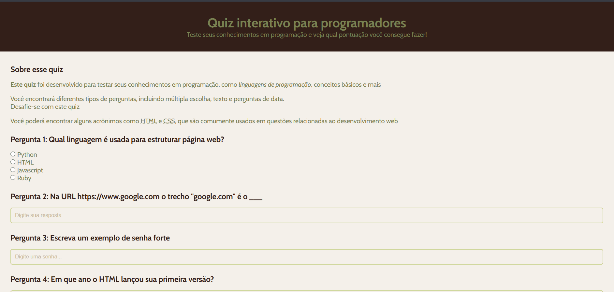

# Quiz Interativo com HTML e CSS🖊️

## Descrição:

Este é um projeto de quiz interativo desenvolvido utilizando apenas HTML e CSS. O objetivo deste projeto é criar uma interface de quiz divertida e intuitiva, permitindo aos usuários responderem a perguntas e visualizarem o resultado final com base nas suas respostas.

## Funcionalidades:

* Interface Simples.✔️
* Exibe perguntas de múltipla escolha.✔️
* Realce visual pra respostas correta.✔️
* Sistema de pontuação ao final do quiz.✔️

## Tecnologias Utilizadas:

* HTML5: Estrutura das perguntas e opções do quiz.✔️
* CSS3: Estilização para tornar o quiz visualmente atraente e interativo, com transição e efeitos visuais.✔️

## Créditos e aprendizados:

Esse aprendizado sobre esse Quiz, foi postado no canal da Rafaella Ballerini, onde a mesma ensina como criar essa página usando HTML e CSS.
Agradeço pelo ensinamento!!

[]
